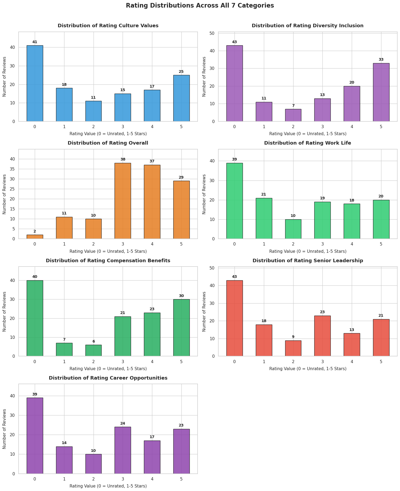

# Overview

## Quantitative Overview 

According to the resulr shown here is a general overviwe for each result

**Rating Overall** — *High*

| Stars | Count | Percentage |
|-------|-------|------------|
| 1★    | 11    | 8.8%       |
| 2★    | 10    | 8.0%       |
| 3★    | 38    | 30.4%      |
| 4★    | 37    | 29.6%      |
| 5★    | 29    | 23.2%      |

**Work-Life Balance**

| Stars | Count | Percentage |
|-------|-------|------------|
| 1★    | 21    | 23.9%      |
| 2★    | 10    | 11.4%      |
| 3★    | 19    | 21.6%      |
| 4★    | 18    | 20.5%      |
| 5★    | 20    | 22.7%      |

**Compensation** — *High (Amazon is giving good pay and benefits)*

| Stars | Count | Percentage |
|-------|-------|------------|
| 1★    | 7     | 8.0%       |
| 2★    | 6     | 6.9%       |
| 3★    | 21    | 24.1%      |
| 4★    | 23    | 26.4%      |
| 5★    | 30    | 34.5%      |

**Leadership** — *Weak (Leadership at Amazon is relatively weak)*

| Stars | Count | Percentage |
|-------|-------|------------|
| 1★    | 18    | 21.4%      |
| 2★    | 9     | 10.7%      |
| 3★    | 23    | 27.4%      |
| 4★    | 13    | 15.5%      |
| 5★    | 21    | 25.0%      |

**Career Opportunities**

| Stars | Count | Percentage |
|-------|-------|------------|
| 1★    | 14    | 15.9%      |
| 2★    | 10    | 11.4%      |
| 3★    | 24    | 27.3%      |
| 4★    | 17    | 19.3%      |
| 5★    | 23    | 26.1%      |

These patterns align with the high layover problem: employees are attracted and temporarily retained by pay and benefits, but are pushed out by management practices, physical/operational intensity, and limited growth — exactly the drivers visible in both Glassdoor text and YouTube narratives.

**What should we look forward** - Amazon Leadership and work life in amazon needs to be flag and keep in mind when working on text analysis in the next move 
## Qualitative Overview